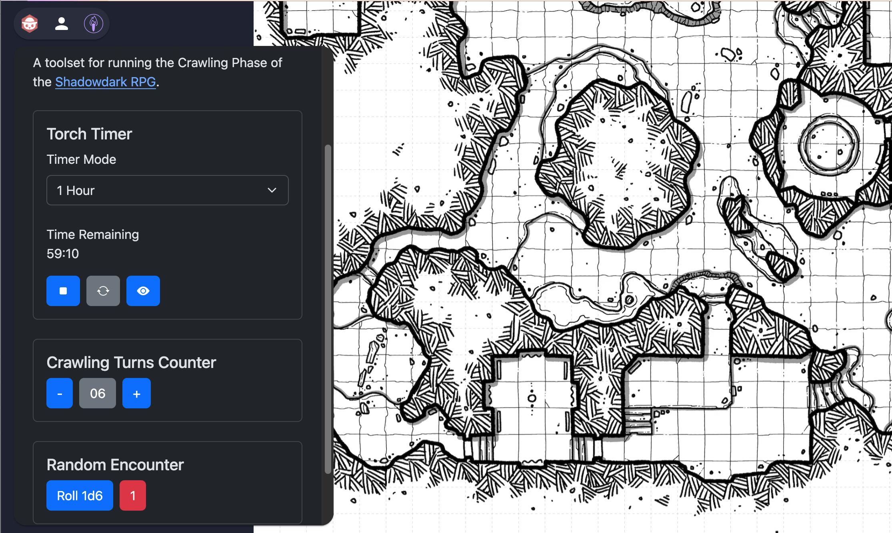
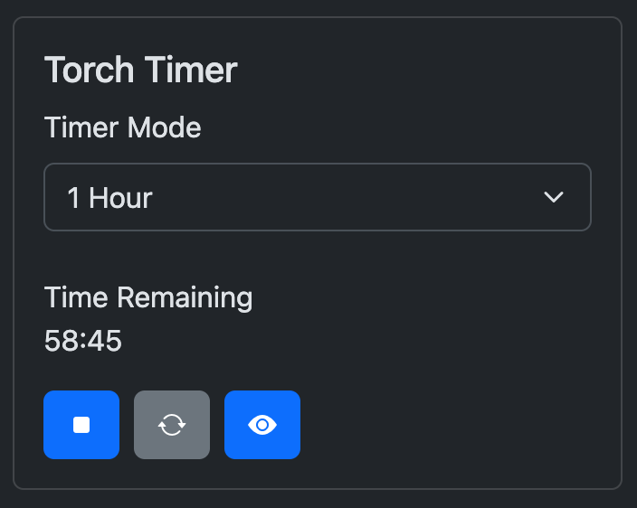
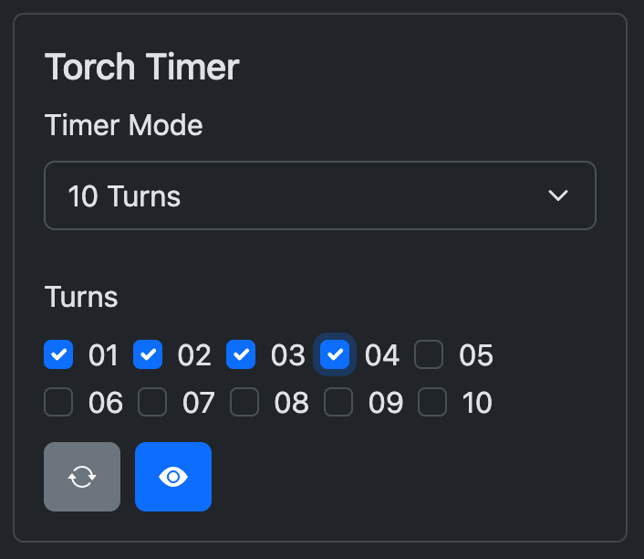
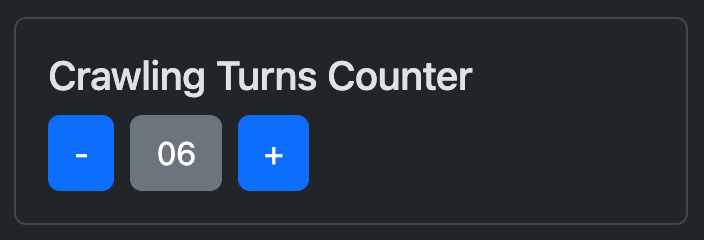
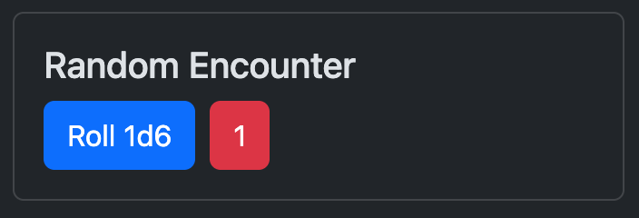
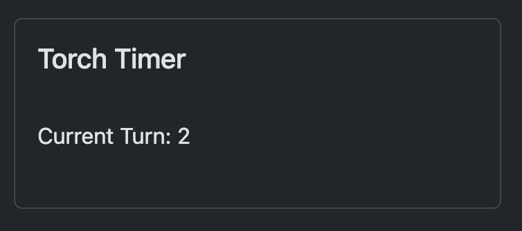

# Shadow Crawler

This extension provides a toolset to run the Crawling phase of the Shadowdark RPG. This
toolset includes the following features.

## Torch Timer

Keep track of the torch either using real-time or turn count.

## Crawling Turns Counter

Keep track of the current crawling turn.

## Random Encounter

Whenever you need to check for a random encounter, you can use this simple dice roller. The result
box will became **red** on a `1`.

## Player View

You can toggle the `Torch Timer` to be visible to the players. And they will see it as follows:

## Data Storage

The extension stores all the data in the browser's local storage, and loads it at startup.
